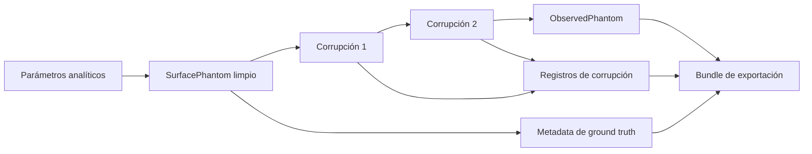
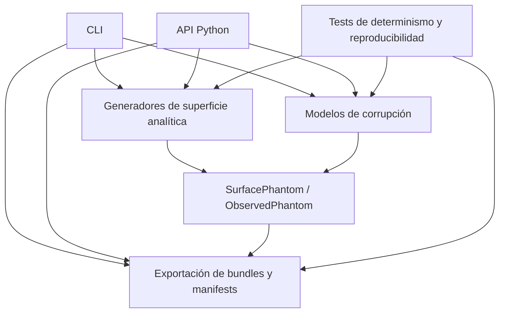

<p align="center">
  
</p>

<div align="center">

# spmkit-phantoms

### Superficies sintéticas deterministas y artefactos controlados para validación SPM

**Los fantasmas son sintéticos. Los modos de fallo son reales.**

[](https://www.python.org/)
[](https://numpy.org/)
[](#estado-científico)
[](#contrato-de-ground-truth)
[](#reproducibilidad)
[](#tests)
[](LICENSE)

<p align="center">
  <a href="README.es.md"></a>
  <a href="README.md"></a>
</p>

[Resumen](#resumen) ·
[Superficies](#superficies-analíticas) ·
[Corrupciones](#corrupciones-controladas) ·
[Inicio rápido](#inicio-rápido) ·
[Reproducibilidad](#reproducibilidad) ·
[Arquitectura](#arquitectura) ·
[Roadmap](#roadmap)

</div>

---

## Resumen

`spmkit-phantoms` es un paquete de Python pequeño e independiente para generar **superficies analíticas 2D con parámetros conocidos**, aplicar **corrupciones controladas tipo SPM**, y exportar la verdad y la observación resultantes como **casos de validación reproducibles**.

Su función es deliberadamente acotada:

```text
definir la verdad
      ↓
generar la superficie limpia
      ↓
aplicar corrupciones explícitas
      ↓
preservar la superficie observada
      ↓
exportar cada parámetro necesario para reproducir el caso
```

Una imagen AFM real contiene realismo, pero la superficie subyacente exacta suele ser desconocida.

Un *phantom* proporciona la contraparte que falta: una superficie numérica cuya geometría se conoce **antes** de que cualquier algoritmo de nivelado, cálculo de rugosidad, filtrado, segmentación, *denoising* o análisis la toque.

> [!IMPORTANT]
> `spmkit-phantoms` es un **generador de *ground truth* para verificación de software y construcción de *benchmarks***.
>
> No es un controlador de microscopio, un material de referencia certificado, un simulador completo de adquisición, ni una afirmación de exactitud experimental universal.

---

## Ecosistema

`spmkit-phantoms` es parte del ecosistema SPM-Kit:

| Repositorio | Función |
|---|---|
| **[spmkit](https://github.com/kegouro/spmkit)** | Motor numérico, API Python, CLI y *workspace* gráfico (Fathom) — el sistema bajo prueba |
| **[spmkit-validation](https://github.com/kegouro/spmkit-validation)** | Arnés externo de validación caja negra que consume *phantoms* como *inputs* de campañas |
| **[spmkit-phantoms](https://github.com/kegouro/spmkit-phantoms)** (este repo) | Superficies sintéticas deterministas con *ground truth* conocido |
| **[spmkit-data-hunter](https://github.com/kegouro/spmkit-data-hunter)** | Descubrimiento y triaje de datasets públicos AFM/SPM |

Los *phantoms* generados aquí alimentan directamente las campañas de `spmkit-validation`. La campaña de validación cruzada *synthetic roughness* v0.1 usó seis superficies de este paquete para verificar Sa, Sq y Sz contra Gwyddion 2.71 (`LEVEL 3 CROSS_VALIDATED`).

> **Find the evidence → define the truth → test the system externally → preserve the result.**

---

## Por qué existe este repositorio

Probar que un *pipeline* de análisis termina sin *crashear* es útil.

Probar que recupera una cantidad conocida es más fuerte.

Un *phantom* controlado puede responder preguntas como:

- ¿El nivelado por plano elimina la inclinación sin borrar la morfología real?
- ¿Se preserva una altura de escalón conocida?
- ¿Cómo cambian `Sa`, `Sq` y `Sz` a medida que aumenta el ruido?
- ¿La corrección de líneas elimina *offsets* o aplana la muestra misma?
- ¿Un filtro de *spikes* elimina artefactos aislados sin recortar picos reales?
- ¿Un *denoiser* preserva estructuras afiladas que estaban ausentes de su conjunto de entrenamiento?
- ¿Se reproduce el mismo caso desde la misma *seed*?
- ¿Cada resultado puede trazarse a su superficie limpia y parámetros de corrupción?

Este repositorio existe para hacer esas preguntas verificables sin pretender que una imagen visualmente plausible es automáticamente una imagen científicamente conocida.

---

## De un vistazo

<table>
<tr>
<td width="33%" valign="top">

### Geometría conocida

Genera superficies con dimensiones, amplitudes, posiciones, pendientes, longitudes de onda y parámetros de *features* explícitos.

</td>
<td width="33%" valign="top">

### Corrupción controlada

Aplica artefactos tipo *scan* como transformaciones visibles y ordenadas, no como *preprocessing* invisible.

</td>
<td width="33%" valign="top">

### Provenance preservado

Retiene *seeds*, unidades, hashes, parámetros, máscaras, esquemas y separación limpia-vs-observada.

</td>
</tr>
<tr>
<td width="33%" valign="top">

### Núcleo determinista

La aleatoriedad se inyecta mediante un `numpy.random.Generator` local.

</td>
<td width="33%" valign="top">

### Independiente del analizador

El paquete no requiere el motor de análisis que luego se probará contra sus *outputs*.

</td>
<td width="33%" valign="top">

### Consciente de metrología

El éxito se evalúa mediante cantidades preservadas, no suavidad cosmética.

</td>
</tr>
</table>

---

## Contrato de *ground truth*

La regla central de `spmkit-phantoms` es simple:

> La superficie limpia y la superficie observada son objetos científicos diferentes.

El *phantom* limpio registra lo que se creó.

El *phantom* observado registra lo que queda después de una secuencia de corrupción declarada.

El paquete nunca debe borrar silenciosamente esa frontera.



### Reglas del contrato

| Regla | Significado |
|---|---|
| **Verdad primero** | Una superficie limpia se genera antes de aplicar cualquier corrupción. |
| **Sin mutación oculta** | Las corrupciones no deben modificar el *array* limpio *in place*. |
| **Aleatoriedad explícita** | Las transformaciones estocásticas reciben un RNG inyectado. |
| **Transformaciones ordenadas** | La secuencia de corrupciones es parte de la definición del caso. |
| **Escalas físicas** | El campo de visión y las unidades de altura permanecen adjuntas al *array*. |
| **Realización registrada** | Los parámetros realmente usados por cada corrupción se preservan. |
| **Identidad estable** | Hashes canónicos pueden identificar *arrays* independientemente de los nombres de archivo. |
| **Alcance honesto** | El generador no promueve éxito sintético a validez física universal. |

---

## Modelo de datos

El repositorio distingue dos conceptos relacionados.

### `SurfacePhantom`

Representa la verdad numérica limpia.

Un *phantom* limpio se espera que contenga o identifique:

- el *array* de alturas;
- dimensiones físicas X e Y;
- unidad Z;
- nombre del modelo de superficie;
- parámetros del modelo;
- *shape* y *dtype* del *array*;
- versión del esquema;
- *seed* cuando el modelo limpio es estocástico;
- cantidades analíticas conocidas por construcción.

### `ObservedPhantom`

Representa el resultado de aplicar una o más corrupciones.

Un *phantom* observado se espera que retenga:

- el *phantom* limpio original;
- el *array* corrompido;
- el historial ordenado de corrupciones;
- parámetros de corrupción realizados;
- máscaras para artefactos localizados cuando aplique;
- *seeds* e información del RNG;
- hashes para *arrays* limpios y observados;
- metadata de exportación y esquema.

> [!NOTE]
> Un *phantom* observado no es "la nueva verdad". Es una representación tipo medición vinculada a la verdad original.

---

## Superficies analíticas

La familia inicial de superficies es intencionalmente interpretable. Cada modelo existe porque expone una clase específica de fallo.

| Superficie | Objetivo de validación | Cantidades conocidas |
|---|---|---|
| **Plano** | controles de señal cero, integridad de baseline | altura constante, rugosidad cero ideal |
| **Plano inclinado** | nivelado y eliminación de pendiente | coeficientes del plano, pendiente, verdad residual |
| **Superficie sinusoidal 2D** | respuesta de amplitud, recuperación de longitud de onda, comportamiento espectral | amplitud, longitud de onda, fase |
| **Superficie de escalón** | preservación de bordes y metrología de altura | alturas de meseta, posición del borde, altura del escalón |
| **Grilla de escalones** | bordes repetidos y comportamiento multi-región | geometría de celda, alturas, posiciones de transición |
| **Partículas gaussianas** | localización y preservación de morfología | centros, amplitudes, anchos, conteo de partículas |

### Por qué las superficies simples importan

Una textura aleatoria complicada puede revelar que dos *outputs* difieren.

Un plano, onda seno, escalón o partícula aislada puede a menudo revelar **por qué** difieren.

Los *phantoms* simples no son por tanto datos de juguete. Son instrumentos de diagnóstico.

---

## Corrupciones controladas

Las corrupciones aproximan clases específicas de defectos de adquisición o imagen mientras preservan el *ground truth* limpio.

| Corrupción | Aproximación | Pregunta típica de validación |
|---|---|---|
| **Ruido gaussiano aditivo** | ruido de medición aleatorio de banda ancha | ¿Qué tan rápido se degradan las cantidades recuperadas con la amplitud de ruido? |
| **Offsets de línea independientes** | saltos de baseline línea a línea | ¿La corrección elimina offsets sin aplanar la morfología real? |
| **Drift lineal** | movimiento lento de baseline a lo largo del scan | ¿El nivelado elimina el drift preservando la estructura de la muestra? |
| **Spikes aislados** | artefactos transitorios impulsivos | ¿Puede el manejo de outliers eliminar spikes sin recortar máximos reales? |

Las corrupciones siguen la interfaz conceptual:

```python
observed, record = corruption.apply(clean, rng)
```

donde:

- `clean` es el *phantom* de entrada no modificado;
- `rng` es un `numpy.random.Generator`;
- `observed` contiene el resultado corrompido;
- `record` contiene los parámetros realmente usados.

### Composición

Múltiples corrupciones pueden aplicarse en un orden declarado:

```text
limpio
  → ruido gaussiano
  → offsets de línea
  → drift lineal
  → spikes
  → observado
```

El orden importa. Un caso de validación debe preservarlo.

### Lo que no es simplemente "ruido"

Lo siguiente pertenece a futuros modelos directos o simulaciones de adquisición dedicadas:

- convolución punta-muestra;
- respuesta del controlador de *feedback*;
- *creep* piezoeléctrico;
- histéresis;
- saturación del detector;
- efectos de velocidad de *scan*;
- deformación de la muestra;
- acoplamiento multicanal.

Meter cada efecto físico en una función llamada `add_noise()` sería conveniente, compacto y científicamente maldito.

---

## Reproducibilidad

La reproducibilidad se trata como un *claim* en capas, no como una insignia decorativa.

### Nivel 1: identidad numérica

La generación repetida con los mismos parámetros y *seed* debe producir *arrays* iguales.

```python
import numpy as np

assert np.array_equal(first.z, second.z)
```

### Nivel 2: identidad canónica de array

Un hash estable debe identificar el *array* científico usando información normalizada tal como:

- *dtype*;
- *shape*;
- orden de bytes;
- bytes normalizados contiguos.

Esto separa la identidad del *array* de la metadata del sistema de archivos.

### Nivel 3: identidad de manifest normalizado

La metadata científica debe coincidir después de excluir solo campos intencionalmente variables, como timestamps cuando están presentes.

### Nivel 4: identidad binaria de artefacto

Los archivos `.npz` exportados pueden adicionalmente compararse byte a byte en entornos controlados.

> [!CAUTION]
> La identidad binaria observada en un sistema no es automáticamente una garantía universal multiplataforma. Los hashes canónicos de array y los manifests normalizados son la evidencia principal de larga duración.

### Reglas de aleatoriedad

- usar `numpy.random.Generator`;
- inyectar el RNG en lugar de crear estado global oculto;
- exponer o registrar la *seed*;
- testar seeds iguales;
- testar seeds diferentes;
- hacer que la corrupción de intensidad cero sea identidad exacta cuando sea física y numéricamente apropiado;
- nunca regenerar una *seed* oculta durante la exportación.

---

## Bundles de exportación

Un caso de validación debe viajar con la información necesaria para reconstruirlo y auditarlo.

Layout típico del bundle:

```text
case_name/
├── clean.npz
├── observed.npz
├── manifest.json
├── corruption_manifest.json
└── masks.npz
```

`masks.npz` solo se necesita cuando una corrupción marca regiones afectadas, como spikes aislados o líneas dañadas.

### Manifest limpio

Puede incluir:

- versión del esquema;
- modelo de superficie;
- parámetros de superficie;
- *shape*;
- *dtype*;
- dimensiones físicas X e Y;
- unidad Z;
- hash del array limpio;
- *seed*;
- valores de referencia analíticos.

### Manifest de corrupción

Puede incluir:

- lista ordenada de corrupciones;
- tipo de corrupción;
- parámetros solicitados;
- parámetros realizados;
- *seed* o provenance del RNG;
- hash del array observado;
- referencias de máscaras;
- advertencias;
- versión del software.

### Por qué importan los hashes

Los nombres de archivo describen.

Los hashes identifican.

Una campaña de validación debe poder probar que el array analizado después es el array generado aquí, incluso después de haberse movido entre carpetas, máquinas, archivos o artefactos de CI.

---

## Inicio rápido

### Requisitos

- Python 3.11 o superior
- NumPy
- pytest para la suite de tests

### Clonar e instalar

```bash
git clone https://github.com/kegouro/spmkit-phantoms.git
cd spmkit-phantoms

python -m venv .venv
source .venv/bin/activate

python -m pip install --upgrade pip
python -m pip install -e ".[test]"
```

Windows PowerShell:

```powershell
git clone https://github.com/kegouro/spmkit-phantoms.git
cd spmkit-phantoms

py -m venv .venv
.venv\Scripts\Activate.ps1

py -m pip install --upgrade pip
py -m pip install -e ".[test]"
```

### Verificar la instalación

```bash
python -m pytest -q
```

### Inspeccionar la interfaz de línea de comandos

```bash
spmkit-phantoms --help
```

### Inspeccionar el paquete instalado

```bash
python - <<'PY'
import spmkit_phantoms

print(spmkit_phantoms.__name__)
print(spmkit_phantoms.__file__)
PY
```

> [!WARNING]
> Antes de un release estable `1.0`, fija el commit o release exacto usado en una campaña de validación. Preserva la versión del paquete, el esquema de manifest, la versión de Python, la versión de NumPy, la seed y los hashes generados.

---

## Patrón de uso en Python

El flujo de trabajo del paquete es intencionalmente pequeño.

```python
from numpy.random import default_rng
from spmkit_phantoms.surfaces import sinusoidal_surface

rng = default_rng(42)

clean = sinusoidal_surface(
    # usar los parámetros expuestos por el release instalado
)

# Seleccionar un modelo de corrupción expuesto por el release instalado.
# observed, record = corruption.apply(clean, rng)

# Exportar la verdad limpia, array observado, parámetros,
# registro de corrupción, máscaras, seed y hashes.
```

Las firmas públicas exactas dependen de la versión antes de `1.0`. El código fuente, los tests y la salida de `--help` son la referencia ejecutable para la revisión instalada.

### Registro de campaña recomendado

Para cada caso generado, preserva:

```text
ID del caso
modelo de superficie
parámetros de superficie
shape del array
dimensiones físicas
unidad Z
orden de corrupciones
parámetros de corrupciones
seed
hash limpio
hash observado
versión del paquete
commit de Git
versión del esquema
```

El artefacto real no es solo una imagen.

Es:

```text
verdad + observación + provenance
```

---

## Arquitectura



### Mapa del repositorio

```text
spmkit-phantoms/
├── branding/
│   └── main-banner.png
├── src/
│   └── spmkit_phantoms/
│       ├── models.py
│       ├── surfaces.py
│       ├── export.py
│       ├── cli.py
│       └── ...
├── tests/
├── pyproject.toml
├── README.md
└── LICENSE
```

El paquete se organiza alrededor de cuatro responsabilidades:

1. representar phantoms limpios y observados;
2. generar verdad analítica;
3. aplicar corrupciones explícitas;
4. exportar evidencia reproducible.

Cualquier cosa no relacionada con esas responsabilidades debe enfrentar una barrera alta antes de entrar a este repositorio.

---

## Límites de diseño

### Este repositorio debe contener

- modelos de superficie analítica;
- modelos de corrupción controlada;
- datos limpios y observados inmutables o separados de forma segura;
- manejo determinista de RNG;
- esquemas de exportación;
- hashes de array y manifest;
- máscaras para corrupción localizada;
- tests unitarios;
- tests de reproducibilidad;
- supuestos científicamente documentados.

### Este repositorio no debe contener

- lectores de archivos AFM;
- algoritmos de análisis de producción;
- calculadoras de rugosidad usadas como referencia bajo prueba;
- modelos de denoising;
- entrenamiento de redes neuronales;
- flujos de GUI;
- control de microscopio;
- código de adquisición específico de fabricante;
- afirmaciones de trazabilidad certificada;
- acceso de red oculto;
- descargas silenciosas de modelos.

Esta frontera no es estética. Protege la independencia del generador de verdad sintética.

---

## Casos de uso científico

`spmkit-phantoms` está diseñado para:

- tests de regresión de nivelado;
- estudios de recuperación de rugosidad;
- benchmarks de corrección de líneas;
- tests de eliminación de spikes;
- benchmarks de preservación de denoising;
- tests de localización de features;
- recuperación de amplitud y longitud de onda;
- datasets de smoke para CI;
- reproducción determinista de bugs;
- construcción de morfologías hold-out;
- barridos controlados de parámetros;
- experimentos de sensibilidad e incertidumbre;
- campañas de validación end-to-end.

### Matriz de validación de ejemplo

| Superficie | Corrupción | Cantidad inspeccionada |
|---|---|---|
| plano inclinado | ninguna | pendiente residual |
| plano inclinado | drift lineal | bias de nivelado |
| superficie seno | ruido gaussiano | amplitud recuperada |
| superficie seno | offsets de línea | distorsión espectral |
| superficie de escalón | ruido gaussiano | error de altura de escalón |
| superficie de escalón | filtrado | redondeo de bordes |
| partículas | spikes | falsos positivos y partículas perdidas |
| partículas | denoising | preservación de ancho y amplitud |

---

## Qué significa éxito

Un test de phantom exitoso significa:

> El algoritmo probado se comportó correctamente para el modelo sintético declarado, rango de parámetros, secuencia de corrupción y criterio de aceptación.

No significa:

> El algoritmo es universalmente preciso para cada microscopio, punta, muestra, entorno y modo de adquisición.

Esta distinción es la línea entre evidencia numérica y humo de marketing.

---

## Lo que este paquete no prueba

Por sí solo, `spmkit-phantoms` no establece:

- trazabilidad física;
- acuerdo con un artefacto de referencia certificado;
- acuerdo con otro paquete de software;
- repetibilidad experimental;
- reproducibilidad inter-instrumento;
- reproducibilidad interlaboratorio;
- validez fuera del dominio simulado;
- cobertura correcta de incertidumbre;
- idoneidad para decisiones reguladas.

Esos requieren evidencia adicional fuera de este repositorio.

---

## Tests

Ejecutar la suite completa:

```bash
python -m pytest
```

Salida compacta:

```bash
python -m pytest -q
```

Inspeccionar tests recolectados:

```bash
python -m pytest --collect-only -q
```

### Comportamientos centrales que deben permanecer testados

- determinismo de superficie limpia;
- shape y dtype esperados;
- preservación de escala física;
- exactitud del plano;
- coeficientes del plano inclinado;
- amplitud sinusoidal;
- altura de escalón;
- posición y ancho de partículas;
- reproducibilidad con misma seed;
- variación con diferente seed;
- identidad de intensidad cero;
- inmutabilidad del array limpio;
- ordenamiento de corrupciones;
- consistencia de máscaras;
- outputs finitos;
- rechazo de parámetros inválidos;
- round trip de exportación;
- hashes canónicos;
- igualdad de manifest normalizado.

### Construir el wheel antes de un release

```bash
python -m pip install build
python -m build
```

Instalar el artefacto construido en un entorno fresco:

```bash
python -m venv .wheel-test
source .wheel-test/bin/activate

python -m pip install --upgrade pip
python -m pip install dist/*.whl
python -m pytest -q
```

---

## Añadir una superficie limpia

Una nueva superficie debe comenzar con una pregunta de validación, no con una ecuación bonita.

Documentar:

1. la definición de la superficie;
2. el propósito científico;
3. unidades de los parámetros;
4. rangos válidos de parámetros;
5. casos degenerados;
6. cantidades de referencia analíticas;
7. orientación esperada del array;
8. campos esperados del manifest;
9. tests deterministas;
10. comportamiento de round trip de exportación.

### Checklist mínimo de revisión

- [ ] La implementación no importa un analizador bajo prueba.
- [ ] Se usan unidades SI internamente.
- [ ] Las entradas se validan.
- [ ] Las cantidades analíticas se documentan.
- [ ] Los casos degenerados fallan claramente.
- [ ] Los mismos inputs producen el mismo array limpio.
- [ ] El resultado se representa como un phantom limpio.
- [ ] La exportación preserva los parámetros del modelo.
- [ ] Los tests cubren extremos y valores conocidos.
- [ ] Se declaran las limitaciones.

---

## Añadir una corrupción

Una nueva corrupción debe describir tanto lo que modela como lo que se niega a modelar.

Documentar:

1. motivación física o instrumental;
2. transformación matemática;
3. parámetros y unidades;
4. requisitos de RNG;
5. si crea una máscara;
6. si la intensidad cero es identidad;
7. efecto esperado en phantoms simples;
8. comportamiento ante input inválido;
9. interacción con el orden de composición;
10. provenance registrado.

### Checklist mínimo de revisión

- [ ] Recibe un `numpy.random.Generator` inyectado.
- [ ] No muta el array limpio.
- [ ] Retorna o preserva un registro de corrupción.
- [ ] Registra los parámetros realizados.
- [ ] Produce output determinista para la misma seed.
- [ ] Produce realizaciones diferentes para seeds diferentes cuando es estocástico.
- [ ] Testa intensidad cero cuando aplique.
- [ ] Preserva shape y unidades.
- [ ] Produce output finito o falla explícitamente.
- [ ] Exporta máscaras cuando se introduce corrupción localizada.

---

## Rendimiento

El paquete prioriza auditabilidad y comportamiento determinista sobre optimización agresiva.

Los cambios de rendimiento no deben:

- alterar outputs con seed silenciosamente;
- cambiar la orientación del array;
- reducir precisión numérica sin documentación;
- mutar arrays compartidos;
- eludir validación de parámetros;
- debilitar el provenance;
- introducir comportamiento dependiente del backend sin tests.

Al optimizar, benchmarkuear tanto el tiempo de ejecución como la equivalencia científica.

Un phantom más rápido que silenciosamente cambia la verdad es simplemente un bug más rápido.

---

## Estado científico

El paquete usa niveles de evidencia explícitos.

| Nivel | Significado |
|---|---|
| `experimental` | implementado, pero la evidencia sigue siendo limitada |
| `software_verified` | ejercitado por tests automatizados |
| `numerically_verified` | comportamiento numérico determinista o conocido es demostrado |
| `cross_validated` | comparado independientemente contra otra implementación |
| `physically_validated` | comparado con una referencia física y modelo de incertidumbre |
| `interlaboratory_validated` | reproducido independientemente entre laboratorios |

Los claims actuales para `spmkit-phantoms` deben mantenerse limitados a los comportamientos realmente cubiertos por sus tests y auditorías de reproducibilidad.

El paquete genera verdad numérica controlada.

No certifica software de análisis aguas abajo.

---

## Limitaciones conocidas

Los modelos actuales son simplificados.

Pueden no representar:

- geometría real de la punta;
- convolución asimétrica;
- dinámica del lazo de feedback;
- drift no lineal;
- creep piezoeléctrico;
- histéresis;
- saturación del detector;
- ruido correlacionado espacialmente;
- interferencia mecánica periódica;
- dependencia de velocidad de scan;
- deformación de la muestra;
- acoplamiento ambiental;
- cross-talk multicanal;
- comportamiento de adquisición específico del fabricante.

Un modelo puede ser útil sin pretender ser completo.

El requisito importante es que sus supuestos permanezcan visibles.

---

## Roadmap

### Fundación implementada

- [x] plano limpio;
- [x] plano inclinado;
- [x] superficie sinusoidal 2D;
- [x] superficies de escalón;
- [x] partículas gaussianas;
- [x] ruido gaussiano aditivo;
- [x] offsets de línea;
- [x] drift lineal;
- [x] spikes aislados;
- [x] seeds explícitas;
- [x] separación limpio-vs-observado;
- [x] verificaciones de reproducibilidad;
- [x] bundles exportables;
- [x] hashes canónicos de array;
- [x] máscaras para artefactos localizados.

### Modelos candidatos futuros

- [ ] líneas de scan faltantes;
- [ ] líneas de scan congeladas;
- [ ] líneas de scan duplicadas;
- [ ] ruido coloreado y correlacionado;
- [ ] interferencia periódica;
- [ ] distorsiones dependientes de dirección de scan;
- [ ] convolución punta-muestra;
- [ ] respuesta simplificada de feedback;
- [ ] creep e histéresis;
- [ ] phantoms multicanal;
- [ ] phantoms de potencial KPFM;
- [ ] releases de benchmark archivados.

### Explícitamente fuera de alcance

- [ ] algoritmos de denoising;
- [ ] entrenamiento de machine learning;
- [ ] parsing de datos de fabricante;
- [ ] control de microscopio;
- [ ] estilizado de figuras de publicación;
- [ ] afirmaciones de metrología certificada.

El generador de verdad debe mantenerse lo suficientemente pequeño para auditar sin asistencia paranormal.

---

## Contribuir

Las contribuciones deben fortalecer una de las cuatro responsabilidades del repositorio:

- representar verdad;
- generar verdad;
- corromper verdad explícitamente;
- preservar verdad y observación reproduciblemente.

Antes de proponer un feature grande, abre un issue describiendo:

- el problema de validación;
- el modelo propuesto;
- sus supuestos;
- unidades de parámetros;
- referencia analítica o independiente;
- output esperado;
- test convincente más pequeño;
- limitaciones conocidas.

Los pull requests pequeños e inspeccionables son preferidos sobre entregas gigantes de features.

### Checklist de pull request

- [ ] El alcance se limita a `spmkit-phantoms`.
- [ ] No se copió código de analizador en el generador.
- [ ] La aleatoriedad se inyecta.
- [ ] Las unidades son explícitas.
- [ ] Los datos limpios permanecen sin cambios.
- [ ] Los parámetros de ground truth se exportan.
- [ ] La reproducibilidad se testea.
- [ ] El comportamiento de fallo se testea.
- [ ] La documentación declara supuestos y limitaciones.
- [ ] Ninguna tolerancia se amplió solo para hacer CI verde.

---

## Licencia

Ver [`LICENSE`](LICENSE) para los términos de licencia de este repositorio.

---

## Citar

Si usas `spmkit-phantoms` en investigación, cítalo según [`CITATION.cff`](CITATION.cff).

## Agradecimientos

Diseñado y desarrollado independientemente por José Labarca Baeza, estudiante de pregrado de Física en la Universidad Técnica Federico Santa María, en el contexto académico del SPM Lab. Tomás Corrales y el SPM Lab en UTFSM proporcionaron datasets experimentales seleccionados y contexto de laboratorio durante el desarrollo y la evaluación.

---

<div align="center">

### `verdad → corrupción → observación → evidencia`

**No temas a los fantasmas. Forjalos.**

[Volver arriba](#spmkit-phantoms)

</div>
