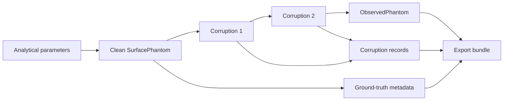
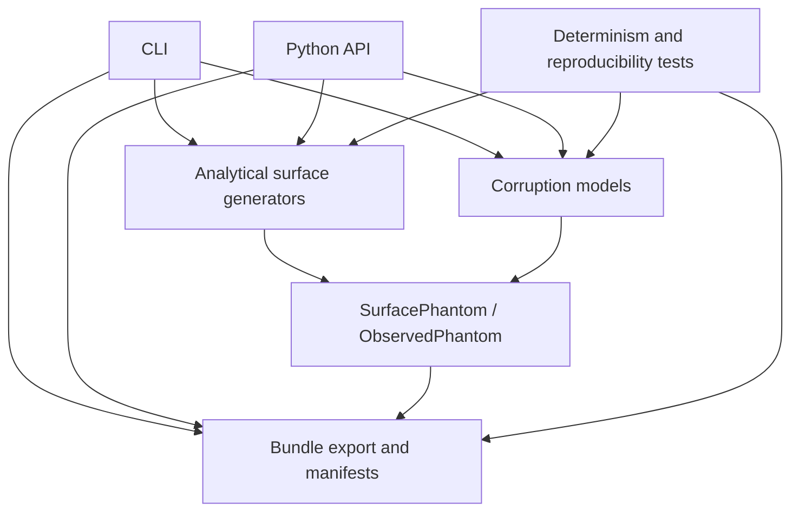

<p align="center">
  
</p>

<div align="center">

# spmkit-phantoms

### Deterministic synthetic surfaces and controlled artifacts for SPM validation

**The ghosts are synthetic. The failure modes are real.**

[](https://www.python.org/)
[](https://numpy.org/)
[](#scientific-status)
[](#ground-truth-contract)
[](#reproducibility)
[](#testing)
[](LICENSE)

<p align="center">
  <a href="README.es.md"></a>
  <a href="README.md"></a>
</p>

[Overview](#overview) ·
[Surfaces](#analytical-surfaces) ·
[Corruptions](#controlled-corruptions) ·
[Quick start](#quick-start) ·
[Reproducibility](#reproducibility) ·
[Architecture](#architecture) ·
[Roadmap](#roadmap)

</div>

---

## Overview

`spmkit-phantoms` is a small, independent Python package for generating **analytical 2D surfaces with known parameters**, applying **controlled SPM-like corruptions**, and exporting the resulting truth and observation as **reproducible validation cases**.

Its job is deliberately narrow:

```text
define the truth
      ↓
generate the clean surface
      ↓
apply explicit corruptions
      ↓
preserve the observed surface
      ↓
export every parameter required to reproduce the case
```

A real AFM image contains realism, but the exact underlying surface is usually unknown.

A phantom provides the missing counterpart: a numerical surface whose geometry is known **before** any leveling, roughness calculation, filtering, segmentation, denoising, or analysis algorithm touches it.

> [!IMPORTANT]
> `spmkit-phantoms` is a **ground-truth generator for software verification and benchmark construction**.
>
> It is not a microscope controller, a certified reference material, a complete acquisition simulator, or a claim of universal experimental accuracy.

---

## Ecosystem

`spmkit-phantoms` is part of the SPM-Kit ecosystem:

| Repository | Role |
|---|---|
| **[spmkit](https://github.com/kegouro/spmkit)** | Numerical engine, Python API, CLI and graphical workspace (Fathom) — the system under test |
| **[spmkit-validation](https://github.com/kegouro/spmkit-validation)** | External black-box validation harness that consumes phantoms as campaign inputs |
| **[spmkit-phantoms](https://github.com/kegouro/spmkit-phantoms)** (this repo) | Deterministic synthetic surfaces with known ground truth |
| **[spmkit-data-hunter](https://github.com/kegouro/spmkit-data-hunter)** | Discovery and triage of public AFM/SPM datasets |

Phantoms generated here can be exported as declared inputs for manually configured
`spmkit-validation` campaigns. The synthetic roughness v0.1 cross-validation campaign
used six surfaces from this package to verify Sa, Sq and Sz against Gwyddion 2.71
(`LEVEL 3 CROSS_VALIDATED`) under its frozen scope.

> **Find the evidence → define the truth → test the system externally → preserve the result.**

[Explore the complete ecosystem portal](https://kegouro.github.io/spmkit/ecosystem/)
for component boundaries, artifact contracts, installation paths, and reproducible
workflow tutorials.

---

## Why this repository exists

Testing that an analysis pipeline finishes without crashing is useful.

Testing that it recovers a known quantity is stronger.

A controlled phantom can answer questions such as:

- Does plane leveling remove tilt without erasing real morphology?
- Is a known step height preserved?
- How do `Sa`, `Sq`, and `Sz` change as noise increases?
- Does line correction remove offsets or flatten the sample itself?
- Does a spike filter remove isolated artifacts without clipping real peaks?
- Does a denoiser preserve sharp structures that were absent from its training set?
- Is the same case reproduced from the same seed?
- Can every result be traced back to its clean surface and corruption parameters?

This repository exists to make those questions testable without pretending that a visually plausible image is automatically a scientifically known image.

---

## At a glance

<table>
<tr>
<td width="33%" valign="top">

### Known geometry

Generate surfaces with explicit dimensions, amplitudes, positions, slopes, wavelengths, and feature parameters.

</td>
<td width="33%" valign="top">

### Controlled corruption

Apply scan-like artifacts as visible, ordered transformations rather than invisible preprocessing.

</td>
<td width="33%" valign="top">

### Preserved provenance

Retain seeds, units, hashes, parameters, masks, schemas, and clean-versus-observed separation.

</td>
</tr>
<tr>
<td width="33%" valign="top">

### Deterministic core

Randomness is injected through a local `numpy.random.Generator`.

</td>
<td width="33%" valign="top">

### Analyzer-independent

The package does not require the analysis engine that will later be tested against its outputs.

</td>
<td width="33%" valign="top">

### Metrology-aware

Success is evaluated through preserved quantities, not cosmetic smoothness.

</td>
</tr>
</table>

---

## Ground-truth contract

The central rule of `spmkit-phantoms` is simple:

> The clean surface and the observed surface are different scientific objects.

The clean phantom records what was created.

The observed phantom records what remains after a declared corruption sequence.

The package must never silently blur that boundary.



### Contract rules

| Rule | Meaning |
|---|---|
| **Truth first** | A clean surface is generated before any corruption is applied. |
| **No hidden mutation** | Corruptions must not modify the clean array in place. |
| **Explicit randomness** | Stochastic transforms receive an injected RNG. |
| **Ordered transforms** | The sequence of corruptions is part of the case definition. |
| **Physical scales** | Field of view and height units remain attached to the array. |
| **Recorded realization** | Parameters actually used by each corruption are preserved. |
| **Stable identity** | Canonical hashes can identify arrays independently of filenames. |
| **Honest scope** | The generator does not promote synthetic success into universal physical validity. |

---

## Data model

The repository distinguishes two related concepts.

### `SurfacePhantom`

Represents the clean numerical truth.

A clean phantom is expected to contain or identify:

- the height array;
- physical X and Y dimensions;
- Z unit;
- surface model name;
- model parameters;
- array shape and dtype;
- schema version;
- seed when the clean model itself is stochastic;
- analytical quantities known from construction.

### `ObservedPhantom`

Represents the result of applying one or more corruptions.

An observed phantom is expected to retain:

- the original clean phantom;
- the corrupted array;
- the ordered corruption history;
- realized corruption parameters;
- masks for localized artifacts when applicable;
- seeds and RNG information;
- hashes for clean and observed arrays;
- export and schema metadata.

> [!NOTE]
> An observed phantom is not “the new truth.” It is a measurement-like representation linked to the original truth.

---

## Analytical surfaces

The initial surface family is intentionally interpretable. Each model exists because it exposes a specific class of failure.

| Surface | Validation target | Known quantities |
|---|---|---|
| **Plane** | zero-signal controls, baseline integrity | constant height, ideal zero roughness |
| **Tilted plane** | leveling and slope removal | plane coefficients, slope, residual truth |
| **2D sinusoidal surface** | amplitude response, wavelength recovery, spectral behavior | amplitude, wavelength, phase |
| **Step surface** | edge preservation and height metrology | plateau heights, edge position, step height |
| **Step grid** | repeated edges and multi-region behavior | cell geometry, heights, transition positions |
| **Gaussian particles** | localization and morphology preservation | centers, amplitudes, widths, particle count |

### Why simple surfaces matter

A complicated random texture can reveal that two outputs differ.

A plane, sine wave, step, or isolated particle can often reveal **why** they differ.

Simple phantoms are therefore not toy data. They are diagnostic instruments.

---

## Controlled corruptions

Corruptions approximate specific classes of acquisition or image defects while preserving the clean ground truth.

| Corruption | Approximation | Typical validation question |
|---|---|---|
| **Additive Gaussian noise** | broadband random measurement noise | How quickly do recovered quantities degrade with noise amplitude? |
| **Independent line offsets** | line-to-line baseline jumps | Does correction remove offsets without flattening real morphology? |
| **Linear drift** | slow baseline movement across the scan | Does leveling remove drift while preserving sample structure? |
| **Isolated spikes** | impulsive transient artifacts | Can outlier handling remove spikes without clipping real maxima? |

Corruptions follow the conceptual interface:

```python
observed, record = corruption.apply(clean, rng)
```

where:

- `clean` is the unmodified input phantom;
- `rng` is a `numpy.random.Generator`;
- `observed` contains the corrupted result;
- `record` contains the parameters actually used.

### Composition

Multiple corruptions may be applied in a declared order:

```text
clean
  → Gaussian noise
  → line offsets
  → linear drift
  → spikes
  → observed
```

The order matters. A validation case must preserve it.

### What is not merely “noise”

The following belong to future forward models or dedicated acquisition simulations:

- tip-sample convolution;
- feedback-controller response;
- piezo creep;
- hysteresis;
- detector saturation;
- scan-speed effects;
- sample deformation;
- multichannel coupling.

Throwing every physical effect into a function called `add_noise()` would be convenient, compact, and scientifically cursed.

---

## Reproducibility

Reproducibility is treated as a layered claim rather than a decorative badge.

### Level 1: numerical identity

Repeated generation with the same parameters and seed should produce equal arrays.

```python
import numpy as np

assert np.array_equal(first.z, second.z)
```

### Level 2: canonical array identity

A stable hash should identify the scientific array using normalized information such as:

- dtype;
- shape;
- byte order;
- contiguous normalized bytes.

This separates array identity from filesystem metadata.

### Level 3: normalized manifest identity

Scientific metadata should match after excluding only fields that are intentionally variable, such as timestamps when they are present.

### Level 4: binary artifact identity

Exported `.npz` files may additionally be compared byte for byte in controlled environments.

> [!CAUTION]
> Binary identity observed on one system is not automatically a universal cross-platform guarantee. Canonical array hashes and normalized manifests are the primary long-lived evidence.

### Randomness rules

- use `numpy.random.Generator`;
- inject the RNG instead of creating hidden global state;
- expose or record the seed;
- test equal seeds;
- test different seeds;
- make zero-intensity corruption exact identity when physically and numerically appropriate;
- never regenerate a hidden seed during export.

---

## Export bundles

A validation case should travel with the information required to reconstruct and audit it.

Typical bundle layout:

```text
case_name/
├── clean.npz
├── observed.npz
├── manifest.json
├── corruption_manifest.json
└── masks.npz
```

`masks.npz` is only needed when a corruption marks affected regions, such as isolated spikes or damaged lines.

### Clean manifest

May include:

- schema version;
- surface model;
- surface parameters;
- shape;
- dtype;
- physical X and Y dimensions;
- Z unit;
- clean-array hash;
- seed;
- analytical reference values.

### Corruption manifest

May include:

- ordered corruption list;
- corruption type;
- requested parameters;
- realized parameters;
- seed or RNG provenance;
- observed-array hash;
- mask references;
- warnings;
- software version.

### Why hashes matter

Filenames describe.

Hashes identify.

A validation campaign should be able to prove that the array analyzed later is the array generated here, even after it has moved between folders, machines, archives, or CI artifacts.

---

## Quick start

### Requirements

- Python 3.11 or newer
- NumPy
- pytest for the test suite

### Clone and install

```bash
git clone https://github.com/kegouro/spmkit-phantoms.git
cd spmkit-phantoms

python -m venv .venv
source .venv/bin/activate

python -m pip install --upgrade pip
python -m pip install -e ".[test]"
```

Windows PowerShell:

```powershell
git clone https://github.com/kegouro/spmkit-phantoms.git
cd spmkit-phantoms

py -m venv .venv
.venv\Scripts\Activate.ps1

py -m pip install --upgrade pip
py -m pip install -e ".[test]"
```

### Verify the installation

```bash
python -m pytest -q
```

### Inspect the command line interface

```bash
spmkit-phantoms --help
```

### Inspect the installed package

```bash
python - <<'PY'
import spmkit_phantoms

print(spmkit_phantoms.__name__)
print(spmkit_phantoms.__file__)
PY
```

> [!WARNING]
> Before a stable `1.0` release, pin the exact commit or release used in a validation campaign. Preserve the package version, manifest schema, Python version, NumPy version, seed, and generated hashes.

---

## Python usage pattern

The package workflow is intentionally small.

```python
from numpy.random import default_rng
from spmkit_phantoms.surfaces import sinusoidal_surface

rng = default_rng(42)

clean = sinusoidal_surface(
    # use the parameters exposed by the installed release
)

# Select a corruption model exposed by the installed release.
# observed, record = corruption.apply(clean, rng)

# Export the clean truth, observed array, parameters,
# corruption record, masks, seed, and hashes.
```

The exact public signatures are version-dependent before `1.0`. The checked-out source, tests, and `--help` output are the executable reference for the installed revision.

### Recommended campaign record

For every generated case, preserve:

```text
case ID
surface model
surface parameters
array shape
physical dimensions
Z unit
corruption order
corruption parameters
seed
clean hash
observed hash
package version
Git commit
schema version
```

The real artifact is not just an image.

It is:

```text
truth + observation + provenance
```

---

## Architecture



### Repository map

```text
spmkit-phantoms/
├── branding/
│   └── main-banner.png
├── src/
│   └── spmkit_phantoms/
│       ├── models.py
│       ├── surfaces.py
│       ├── export.py
│       ├── cli.py
│       └── ...
├── tests/
├── pyproject.toml
├── README.md
└── LICENSE
```

The package is organized around four responsibilities:

1. represent clean and observed phantoms;
2. generate analytical truth;
3. apply explicit corruptions;
4. export reproducible evidence.

Anything unrelated to those responsibilities should face a high bar before entering this repository.

---

## Design boundaries

### This repository should contain

- analytical surface models;
- controlled corruption models;
- immutable or safely separated clean and observed data;
- deterministic RNG handling;
- export schemas;
- array and manifest hashes;
- masks for localized corruption;
- unit tests;
- reproducibility tests;
- scientifically documented assumptions.

### This repository should not contain

- AFM file readers;
- production analysis algorithms;
- roughness calculators used as the reference under test;
- denoising models;
- neural-network training;
- GUI workflows;
- microscope control;
- vendor-specific acquisition code;
- claims of certified traceability;
- hidden network access;
- silent model downloads.

This boundary is not aesthetic. It protects the independence of the synthetic truth generator.

---

## Scientific use cases

`spmkit-phantoms` is designed for:

- leveling regression tests;
- roughness recovery studies;
- line-correction benchmarks;
- spike-removal tests;
- denoising preservation benchmarks;
- feature-localization tests;
- amplitude and wavelength recovery;
- CI smoke datasets;
- deterministic bug reproduction;
- hold-out morphology construction;
- controlled parameter sweeps;
- uncertainty and sensitivity experiments;
- end-to-end validation campaigns.

### Example validation matrix

| Surface | Corruption | Quantity inspected |
|---|---|---|
| tilted plane | none | residual slope |
| tilted plane | linear drift | leveling bias |
| sine surface | Gaussian noise | recovered amplitude |
| sine surface | line offsets | spectral distortion |
| step surface | Gaussian noise | step-height error |
| step surface | filtering | edge rounding |
| particles | spikes | false positives and missed particles |
| particles | denoising | width and amplitude preservation |

---

## What success means

A successful phantom test means:

> The tested algorithm behaved correctly for the declared synthetic model, parameter range, corruption sequence, and acceptance criterion.

It does not mean:

> The algorithm is universally accurate for every microscope, tip, sample, environment, and acquisition mode.

This distinction is the line between numerical evidence and marketing smoke.

---

## What this package does not prove

By itself, `spmkit-phantoms` does not establish:

- physical traceability;
- agreement with a certified reference artifact;
- agreement with another software package;
- experimental repeatability;
- inter-instrument reproducibility;
- interlaboratory reproducibility;
- validity outside the simulated domain;
- correct uncertainty coverage;
- suitability for regulated decisions.

Those require additional evidence outside this repository.

---

## Testing

Run the complete suite:

```bash
python -m pytest
```

Compact output:

```bash
python -m pytest -q
```

Inspect collected tests:

```bash
python -m pytest --collect-only -q
```

### Core behaviors that should remain tested

- clean-surface determinism;
- expected shape and dtype;
- physical scale preservation;
- plane exactness;
- tilted-plane coefficients;
- sinusoidal amplitude;
- step height;
- particle position and width;
- equal-seed reproducibility;
- different-seed variation;
- zero-intensity identity;
- clean-array immutability;
- corruption ordering;
- mask consistency;
- finite outputs;
- invalid-parameter rejection;
- export round trip;
- canonical hashes;
- normalized manifest equality.

### Build the wheel before a release

```bash
python -m pip install build
python -m build
```

Install the built artifact into a fresh environment:

```bash
python -m venv .wheel-test
source .wheel-test/bin/activate

python -m pip install --upgrade pip
python -m pip install dist/*.whl
python -m pytest -q
```

---

## Adding a clean surface

A new surface should begin with a validation question, not with a pretty equation.

Document:

1. the surface definition;
2. the scientific purpose;
3. parameter units;
4. valid parameter ranges;
5. degenerate cases;
6. analytical reference quantities;
7. expected array orientation;
8. expected manifest fields;
9. deterministic tests;
10. export round-trip behavior.

### Minimum review checklist

- [ ] The implementation does not import an analyzer under test.
- [ ] SI units are used internally.
- [ ] Inputs are validated.
- [ ] Analytical quantities are documented.
- [ ] Degenerate cases fail clearly.
- [ ] Same inputs produce the same clean array.
- [ ] The result is represented as a clean phantom.
- [ ] Export preserves model parameters.
- [ ] Tests cover extrema and known values.
- [ ] Limitations are stated.

---

## Adding a corruption

A new corruption must describe both what it models and what it refuses to model.

Document:

1. physical or instrumental motivation;
2. mathematical transformation;
3. parameters and units;
4. RNG requirements;
5. whether it creates a mask;
6. whether zero intensity is identity;
7. expected effect on simple phantoms;
8. invalid-input behavior;
9. interaction with composition order;
10. recorded provenance.

### Minimum review checklist

- [ ] Receives an injected `numpy.random.Generator`.
- [ ] Does not mutate the clean array.
- [ ] Returns or preserves a corruption record.
- [ ] Records realized parameters.
- [ ] Produces deterministic output for the same seed.
- [ ] Produces different realizations for different seeds when stochastic.
- [ ] Tests zero intensity where applicable.
- [ ] Preserves shape and units.
- [ ] Produces finite output or fails explicitly.
- [ ] Exports masks when localized corruption is introduced.

---

## Performance

The package prioritizes auditability and deterministic behavior over aggressive optimization.

Performance changes should not:

- alter seeded outputs silently;
- change array orientation;
- reduce numerical precision without documentation;
- mutate shared arrays;
- bypass parameter validation;
- weaken provenance;
- introduce backend-dependent behavior without tests.

When optimizing, benchmark both runtime and scientific equivalence.

A faster phantom that quietly changes the truth is simply a faster bug.

---

## Scientific status

The package uses explicit evidence levels.

| Level | Meaning |
|---|---|
| `experimental` | implemented, but evidence remains limited |
| `software_verified` | exercised by automated tests |
| `numerically_verified` | deterministic or known numerical behavior is demonstrated |
| `cross_validated` | independently compared against another implementation |
| `physically_validated` | compared with a physical reference and uncertainty model |
| `interlaboratory_validated` | independently reproduced across laboratories |

Current claims for `spmkit-phantoms` should remain limited to the behaviors actually covered by its tests and reproducibility audits.

The package generates controlled numerical truth.

It does not certify downstream analysis software.

---

## Known limitations

Current models are simplified.

They may not represent:

- real tip geometry;
- asymmetric convolution;
- feedback-loop dynamics;
- nonlinear drift;
- piezo creep;
- hysteresis;
- detector saturation;
- spatially correlated noise;
- periodic mechanical interference;
- scan-speed dependence;
- sample deformation;
- environmental coupling;
- multichannel cross-talk;
- vendor-specific acquisition behavior.

A model can be useful without pretending to be complete.

The important requirement is that its assumptions remain visible.

---

## Roadmap

### Implemented foundation

- [x] clean plane;
- [x] tilted plane;
- [x] 2D sinusoidal surface;
- [x] step surfaces;
- [x] Gaussian particles;
- [x] Gaussian additive noise;
- [x] line offsets;
- [x] linear drift;
- [x] isolated spikes;
- [x] explicit seeds;
- [x] clean-versus-observed separation;
- [x] reproducibility checks;
- [x] exportable bundles;
- [x] canonical array hashes;
- [x] masks for localized artifacts.

### Candidate next models

- [ ] missing scan lines;
- [ ] frozen scan lines;
- [ ] duplicated scan lines;
- [ ] colored and correlated noise;
- [ ] periodic interference;
- [ ] scan-direction-aware distortions;
- [ ] tip-sample convolution;
- [ ] simplified feedback response;
- [ ] creep and hysteresis;
- [ ] multichannel phantoms;
- [ ] KPFM potential phantoms;
- [ ] archived benchmark releases.

### Explicitly outside scope

- [ ] denoising algorithms;
- [ ] machine-learning training;
- [ ] vendor data parsing;
- [ ] microscope control;
- [ ] publication figure styling;
- [ ] certified metrology claims.

The truth generator should stay small enough to audit without paranormal assistance.

---

## Contributing

Contributions should strengthen one of the repository’s four responsibilities:

- represent truth;
- generate truth;
- corrupt truth explicitly;
- preserve truth and observation reproducibly.

Before proposing a large feature, open an issue describing:

- the validation problem;
- the proposed model;
- its assumptions;
- parameter units;
- analytical or independent reference;
- expected output;
- smallest convincing test;
- known limitations.

Small, inspectable pull requests are preferred over giant feature drops.

### Pull request checklist

- [ ] Scope is limited to `spmkit-phantoms`.
- [ ] No analyzer code was copied into the generator.
- [ ] Randomness is injected.
- [ ] Units are explicit.
- [ ] Clean data remains unchanged.
- [ ] Ground-truth parameters are exported.
- [ ] Reproducibility is tested.
- [ ] Failure behavior is tested.
- [ ] Documentation states assumptions and limitations.
- [ ] No tolerance was widened merely to make CI green.

---

## License

See [`LICENSE`](LICENSE) for the license terms of this repository.

---

## Citation

If you use `spmkit-phantoms` in research, cite it per [`CITATION.cff`](CITATION.cff).

## Acknowledgements

José Labarca Baeza is the creator, author, and lead developer.

Tomás Corrales and the SPM Lab at Universidad Técnica Federico Santa María provided selected experimental datasets and laboratory context during the development and evaluation of SPM-Kit.

María Saavedra Fredes and Benjamin Schleyer helped locate and share candidate datasets for the validation campaigns.

These acknowledgements do not assign software authorship or institutional ownership.
They do not imply that every located dataset was used, accepted, redistributable, or
scientifically suitable.

---

<div align="center">

### `truth → corruption → observation → evidence`

**Don’t fear the phantoms. Forge them.**

[Back to top](#spmkit-phantoms)

</div>
